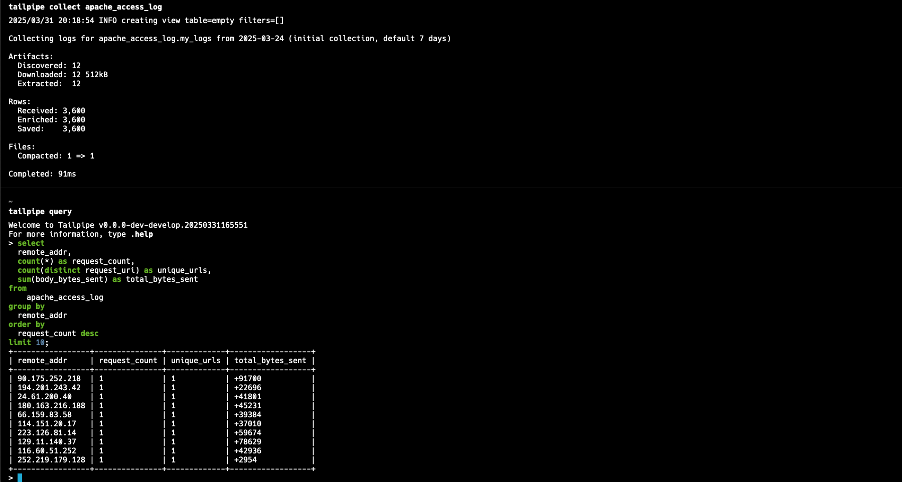

# Apache Plugin for Tailpipe

[Tailpipe](https://tailpipe.io) is an open-source CLI tool that allows you to collect logs and query them with SQL.

[Apache](https://httpd.apache.org/) is a popular open-source web server.

The [Apache Plugin for Tailpipe](https://hub.tailpipe.io/plugins/turbot/apache) allows you to collect and query Apache access logs using SQL to track activity, monitor trends, detect anomalies, and more!

- **[Get started →](https://hub.tailpipe.io/plugins/turbot/apache)**
- Documentation: [Table definitions & examples](https://hub.tailpipe.io/plugins/turbot/apache/tables)
- Community: [Join #tailpipe on Slack →](https://turbot.com/community/join)
- Get involved: [Issues](https://github.com/turbot/tailpipe-plugin-apache/issues)

Collect and query logs:


## Getting Started

Install Tailpipe from the [downloads](https://tailpipe.io/downloads) page:

```sh
# MacOS
brew install turbot/tap/tailpipe
```

```sh
# Linux or Windows (WSL)
sudo /bin/sh -c "$(curl -fsSL https://tailpipe.io/install/tailpipe.sh)"
```

Install the plugin:

```sh
tailpipe plugin install apache
```

Configure your table partition and data source:

```sh
vi ~/.tailpipe/config/apache.tpc
```

```hcl
partition "apache_access_log" "my_logs" {
  source "file" {
    paths       = ["/var/log/apache/access/"]
    file_layout = `%{DATA}.log`
  }
}
```

**Note**: By default, the `apache_access_log` table can collect logs using the [common](https://httpd.apache.org/docs/current/logs.html#common) and [combined](https://httpd.apache.org/docs/current/logs.html#combined) log formats. If your logs use a custom log format, please see [Collect logs with custom log format](https://hub.tailpipe.io/plugins/turbot/apache/tables/apache_access_log#collect-logs-with-custom-log-format).

Download, enrich, and save logs from your source ([examples](https://tailpipe.io/docs/reference/cli/collect)):

```sh
tailpipe collect apache_access_log
```

Enter interactive query mode:

```sh
tailpipe query
```

Run a query:

```sql
select
  remote_addr,
  status,
  request_uri,
  request_method,
  count(*) as request_count
from 
  apache_access_log
group by 
  remote_addr, 
  status, 
  request_uri, 
  request_method
order by 
  request_count desc
limit 1;
```

```sh
+-----------------+--------+-------------------+----------------+---------------+
| remote_addr     | status | request_uri       | request_method | request_count |
+-----------------+--------+-------------------+----------------+---------------+
| 186.187.161.169 | 502    | /path/to/web/page | POST           | 12345         |
+-----------------+--------+-------------------+----------------+---------------+
```


## Developing

Prerequisites:

- [Tailpipe](https://tailpipe.io/downloads)
- [Golang](https://golang.org/doc/install)

Clone:

```sh
git clone https://github.com/turbot/tailpipe-plugin-apache.git
cd tailpipe-plugin-apache
```

After making your local changes, build the plugin, which automatically installs the new version to your `~/.tailpipe/plugins` directory:

```sh
make
```

Re-collect your data:

```sh
tailpipe collect apache_access_log
```

Try it!

```sh
tailpipe query
> .inspect apache_access_log
```

## Open Source & Contributing

This repository is published under the [Apache 2.0](https://www.apache.org/licenses/LICENSE-2.0) (source code) and [CC BY-NC-ND](https://creativecommons.org/licenses/by-nc-nd/2.0/) (docs) licenses. Please see our [code of conduct](https://github.com/turbot/.github/blob/main/CODE_OF_CONDUCT.md). We look forward to collaborating with you!

[Tailpipe](https://tailpipe.io) is a product produced from this open source software, exclusively by [Turbot HQ, Inc](https://turbot.com). It is distributed under our commercial terms. Others are allowed to make their own distribution of the software, but cannot use any of the Turbot trademarks, cloud services, etc. You can learn more in our [Open Source FAQ](https://turbot.com/open-source).

## Get Involved

**[Join #tailpipe on Slack →](https://turbot.com/community/join)**

Want to help but don't know where to start? Pick up one of the `help wanted` issues:

- [Tailpipe](https://github.com/turbot/tailpipe/labels/help%20wanted)
- [Apache Plugin](https://github.com/turbot/tailpipe-plugin-apache/labels/help%20wanted)
